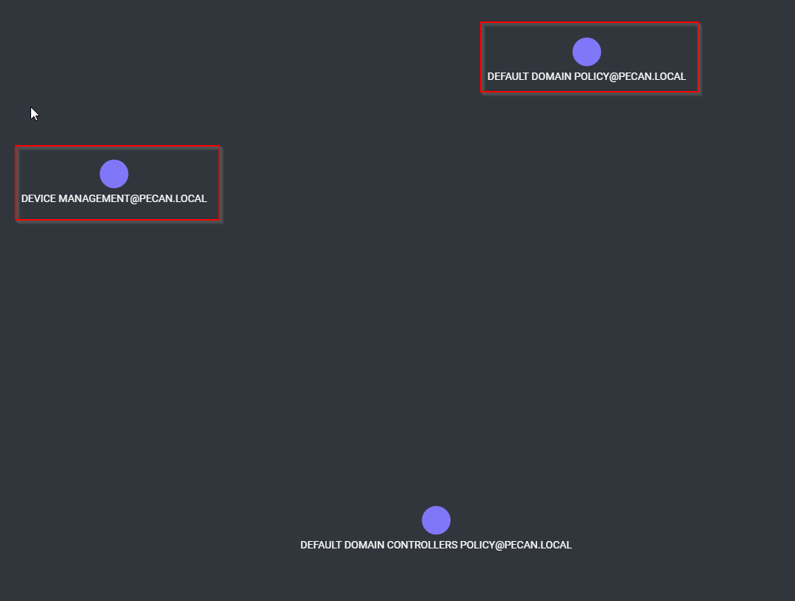

Flag:
> pecan{DEVICE MANAGEMENT-DEFAULT DOMAIN POLICY} or pecan{DEFAULT DOMAIN POLICY-DEVICE MANAGEMENT}

Solution:

1. Use BloodHound session from the previous challenge.
2. In the center bottom open the query section.
3. Run "Match (n:GPO) return n" to get all GPO's
3. Hover over circles to get GPO Names. Dont include the Domain Controller Policy as its not applied to Workstations.
4. Names can also be obtained by the sysvol file provided.

