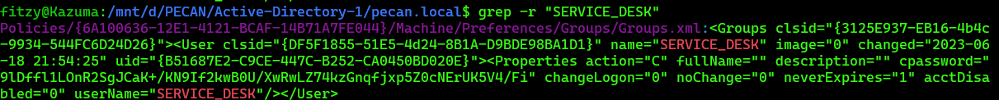
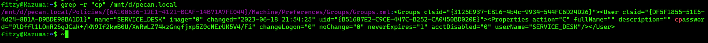
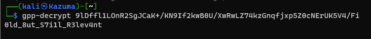

Flag:
> pecan{ServiceDesk-0ld_8ut_S7i1l_R3lev4nt}

Solution:

1. View the GPO policies in the sysvol folder.
2. Grep the directory for the user account "ServiceDesk"
3. Find the file the user is found in and grab the cpassword.
4. Crack the password with gpp-decrypt <Hash>

> grep -r "SERVICE_DESK"
> gpp-decrypt <Hash>

