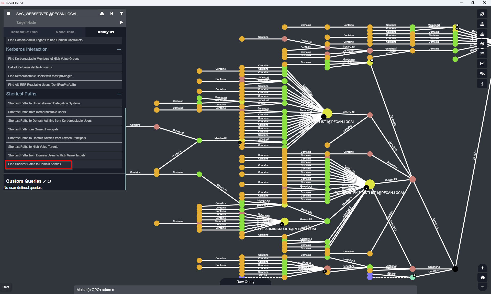
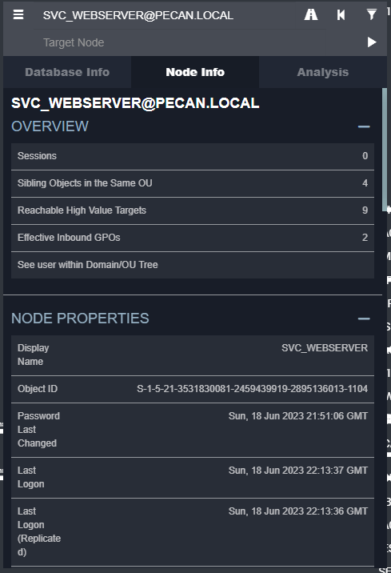
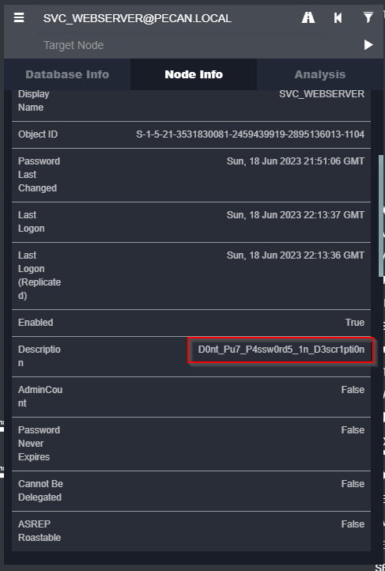

Flag:
> pecan{SVC_WEBSERVER-D0nt_Pu7_P4ssw0rd5_1n_D3scr1pti0n}

Solution:

1. In the current BloodHound session run the Find Shortest Path to Domain Admin search.
2. Find the user in the map and click on it.
2. Review the content for the user and you will find the description is the password.

