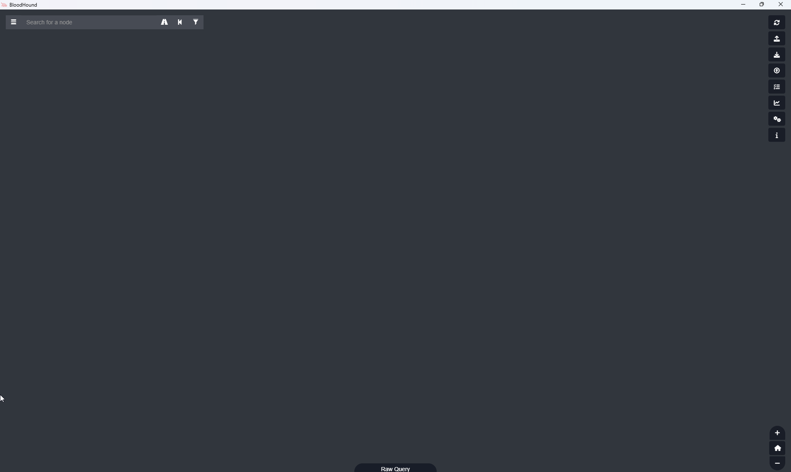
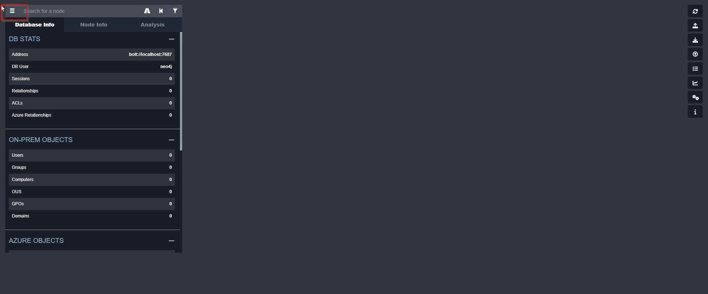
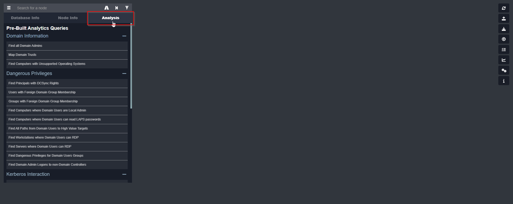
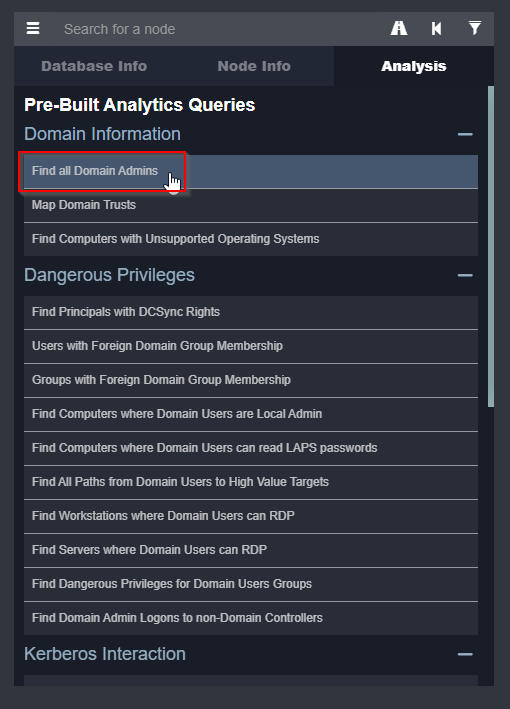
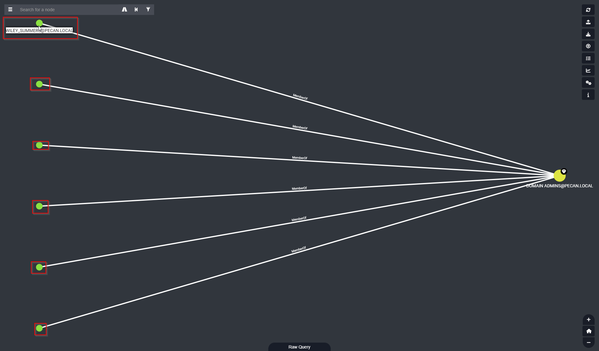

Flag:
> pecan{ADMINISTRATOR-CEDRIC_ENGLAND-DIANN_FOREMAN-REYES_GUY-SONYA_BENDER-WILEY_SUMMERS}

Solution:

1. Open Bloodhound and Upload the data into the tool.
2. Click on the top left hand corner selection tool.
3. Click Analysis
4. Find "Find all Domain Admins" and run the search.
5. Hover over the circles to display the names. Write them down as the flag.

